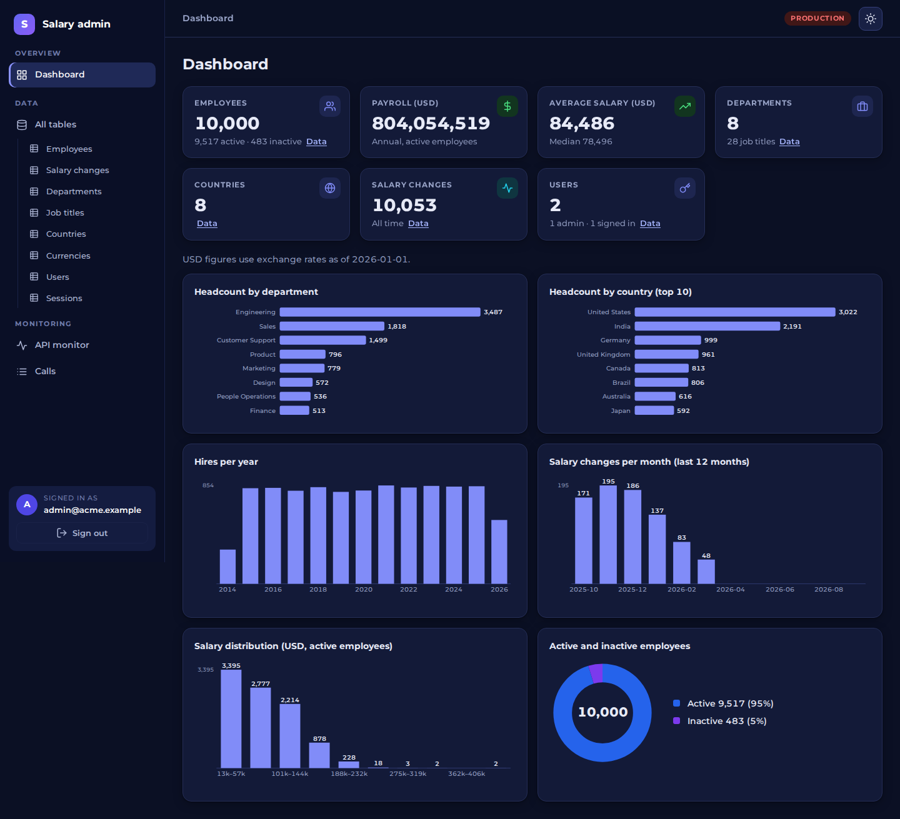
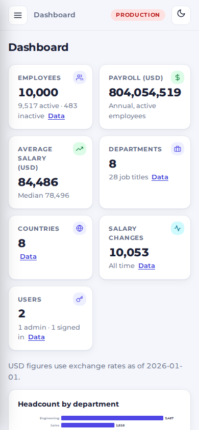
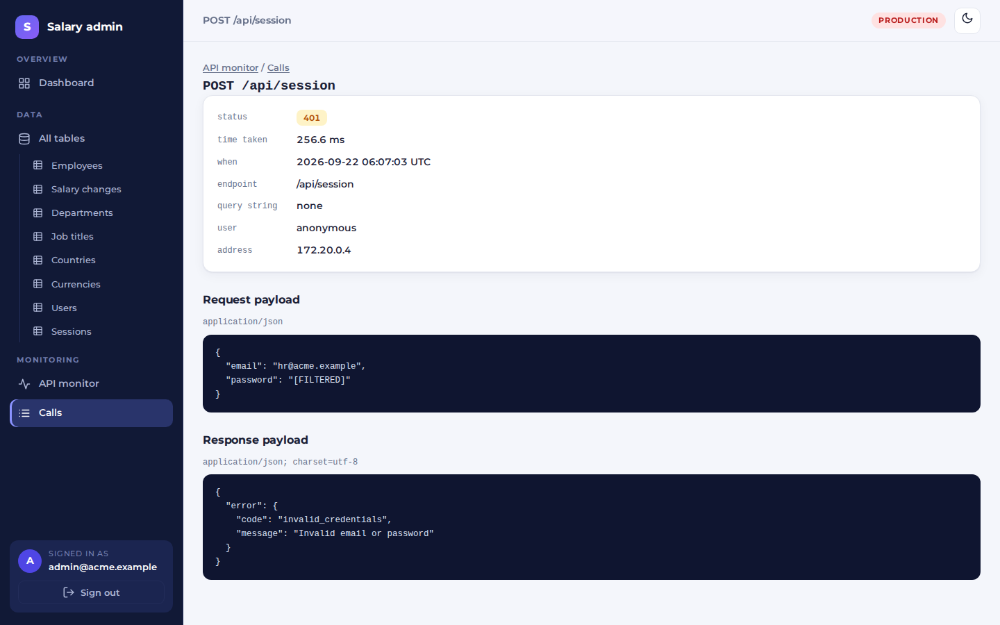

# Administrator panel

A server-rendered part of the Rails app at **`/admin`**, for whoever runs the system, separate from the HR manager's
React app. It has three things: **all the data**, **graphs**, and an **API monitor** that shows which APIs exist, how
each is doing, and the payload and response of every call.

It is plain HTML rendered by Rails (no JavaScript, and the graphs are SVG drawn on the server), so it has nothing to
build and nothing to keep in step with the React app.

## Look and feel

A fixed sidebar grouped into Overview, Data (every table listed) and Monitoring, a
light and a dark theme (a click remembers the choice; with nothing saved it follows
the system, and the right one is applied before the page is drawn, so it never
flashes the other), and a drawer instead of the sidebar under 960px wide. The whole
panel is set in **Montserrat**, self-hosted (`public/admin-assets/fonts`, SIL Open
Font License) so it asks nothing of any other site. The stylesheet and script are one
file each, their address carrying a version taken from their own content so a deploy
is never left showing a cached one.

| Dark theme | Small screen |
|---|---|
|  |  |

## Signing in

| | |
|---|---|
| Address | `/admin` (it sends a visitor who is not signed in to `/admin/login`) |
| Local development | `admin@acme.example` / `admin-panel-demo`, created by `bin/rails db:seed` |
| Anywhere else | set `ADMIN_EMAIL` and `ADMIN_PASSWORD`; they create (or reset) the administrator's login every time the app starts |

An administrator is a `User` whose `admin` column is true. The HR manager's login is an ordinary user and **cannot**
open the panel, and an administrator's session does not open the HR API either: they are two doors with two cookies.

- The panel's session is its own cookie, `_salary_admin` (httpOnly, `SameSite=Lax`, `Secure` behind TLS), valid for 8
  hours. The sign-in time is also checked on the server, so a copied cookie does not outlive the 8 hours.
- The role is checked on every request: removing `admin` from a user ends their access at once.
- A wrong password, an unknown email and an HR account all get the same "Invalid email or password". Attempts are
  rate limited (10 in 3 minutes per address), and every form carries a forgery token.
- Signing out is a `POST /admin/logout`. (It was a `DELETE` at first; a browser form cannot send one without a
  script, so the button did nothing. The browser test found that.)

## The dashboard

Seven numbers, each linking to its data (employees active and inactive, payroll, average and median salary in USD,
departments, countries, salary changes, users), and six graphs: headcount by department, headcount by country (top
10), hires per year, salary changes per month (last 12), the salary distribution and active against inactive. The pay
figures come from the same `Insights::*` code as the HR dashboard, so the two cannot disagree. All of it is a fixed
number of grouped SQL queries however many rows there are.

## Data: every table, read-only

`/admin/tables` lists the eight tables with their row counts. Each opens as a paged list (25 rows, at most 100) that
can be **searched** (every text column, or an id), **sorted** by any column, and **narrowed** to the rows of one
related record. A row opens as a record with every column, links to the rows it points at, and counts of the rows that
point at it (each a link to the filtered list).

- Nothing can be changed here. It is for looking.
- The table name comes from a fixed list, sort and filter columns are checked against the table's columns, and
  anything else is ignored, so a hand-edited address cannot reach SQL or make the page fail.
- **`password_digest` is never selected**, so it cannot be shown, searched or sorted on.
- Everything from the database is escaped when shown.

## API monitor

`/admin/api` answers "which APIs are running and how are they doing?":

- a **live check**: is the database answering (and how fast), is recording on, how many calls are kept;
- the last 24 hours in five numbers, calls per hour, and how statuses divide;
- **every endpoint the API offers** (17, read from the router, so the list cannot drift from the code) with a state,
  calls, 4xx and 5xx counts, average time, the last call and its status, and a link to that endpoint's calls.

| State | Meaning (over the last 24 hours) |
|---|---|
| idle | nothing was recorded |
| healthy | it was called and never answered with a server error (a caller's mistakes, 4xx, do not count) |
| degraded | it failed on the server earlier, but its latest call was fine |
| failing | its latest call failed on the server |

`/admin/api/requests` lists the calls, newest first, filtered by method, status (or class, `4xx`), endpoint (or "matched
no endpoint"), a search of the path and query string, user and slowness. `/admin/api/requests/:id` shows one call in
full: status, time taken, endpoint, query string, user, address, and the **request payload and the response** as
readable JSON.

### How calls are recorded

A Rack middleware, `ApiRequestLogger` (`backend/lib/middleware`), sits just outside Rails' error handling, so it sees
the response the caller really gets, error pages included, and a failure that escapes the app is recorded as a 500 and
then raised again. It records only `/api` (never the admin panel, whose sign-in carries a password), and it can never
get in the way: if the log cannot be written, the failure is logged and the caller still gets their answer.

### What is kept, and what is not

Payloads can hold secrets, and responses hold people's pay, so what may be stored is decided in one place,
`ApiMonitor::Redactor`:

- JSON and form bodies keep their shape, but **the value under any key that looks like a secret is replaced with
  `[FILTERED]`**: keys containing `passw`, `secret`, `token`, `_key`, `crypt`, `salt`, `certificate`, `otp`, `ssn`,
  `cvv`, `cvc`, `digest`, `authorization` or `cookie`, at any depth, in any case. The query string gets the same
  treatment.
- Names, emails and salaries are **not** filtered: they are the data the administrator came to see (and are already
  browsable under Data).
- What cannot be checked for secrets is **described, not stored**: CSV downloads, malformed JSON, other content types,
  and bodies over 1 MB.
- A payload is cut at 20 KB (on a character boundary) and flagged as cut.
- Headers and cookies are never stored.

### Retention, and what it costs

The newest 5,000 calls are kept; the table is trimmed every 50th write. Worst case that is about 200 MB (two 20 KB
payloads per call), but typical payloads are a few kilobytes. The limits are in `config/application.rb`
(`config.x.api_monitor`); `API_MONITOR=false` turns recording off (the page then says so). It is off in the test
environment.

Recording costs about **6 to 11 ms per call**, measured against a development server with 10,000 employees
([performance.md](performance.md#the-cost-of-the-api-monitor)): one INSERT, and parsing and filtering the response.

### Things to know

- Because responses are stored, **the log holds personal data** (names, emails, pay of whoever the HR manager looked
  at) for as long as those rows are kept. Anyone who can open the panel can read it. Turn recording off, or lower the
  row limit, if that is not acceptable.
- Recording is synchronous. Moving it to a background job would remove most of the 6 to 11 ms, at the price of a job
  queue this app deliberately does not have.
- The log is per database, not per server process, so it is the same whichever Puma worker answered.

## Where it is in the code

| | |
|---|---|
| `app/controllers/admin/` | `BaseController` (guard, session, 404), sessions, dashboard, tables, records, API monitor, API requests |
| `app/queries/admin/` | `Table` (the browser's one query object), `Metrics`, `Pagination` |
| `app/queries/api_monitor/` | `Endpoints`, `Stats`, `Log` |
| `app/services/api_monitor/` | `Redactor`, `Recorder`, `LiveCheck` |
| `app/helpers/admin_*` | presentation, and the SVG chart helper |
| `lib/middleware/api_request_logger.rb` | the middleware |
| `test/` | the backend grew from 265 to 487 tests for this, plus one browser test in `e2e/tests/admin-panel.spec.ts` |
