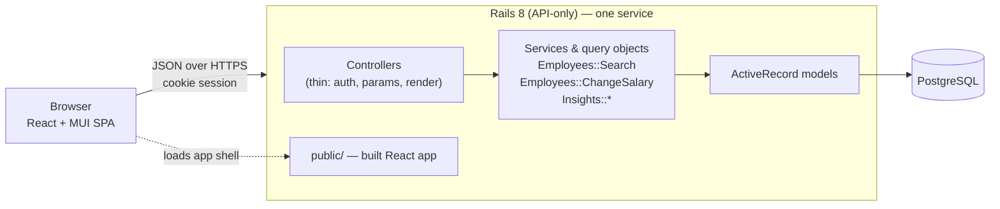
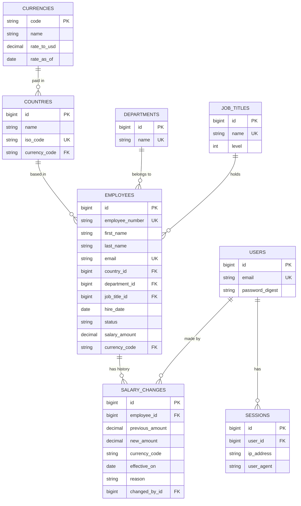

# Implementation Plan

How we will build the salary management software: the decisions, the design, and above all the
**order of work**, which is test-first. Read [requirements.md](requirements.md) first for the *what* and *why*.
This document is the *how*.

> Status: **plan**. Nothing below is built yet except the empty Rails + React scaffold. Sections marked
> *(decision)* are choices we made on purpose and can be challenged; the reasoning is next to each one.

---

## 1. Approach in one paragraph

A **Rails 8 API** backed by **PostgreSQL** and a **React + TypeScript** single-page app, deployed as one
service (Rails serves the built React app, so there is one origin and no CORS). Every behaviour is
built **test-first** in thin vertical slices (database → API → UI). Statistics are computed **in SQL**, not in
Ruby or the browser. The 10,000-employee dataset comes from a **deterministic seed script** so the
demo, tests and performance checks all see the same data.

## 2. Key decisions

| # | Decision | Alternatives considered | Why |
|---|---|---|---|
| D1 | **Rails 8 API-only + React SPA in one repo** (`backend/`, `frontend/`) | Rails full-stack with Hotwire; Next.js | The brief asks for a Rails backend and a React UI. A monorepo keeps history, CI and docs in one place. |
| D2 | **PostgreSQL** | SQLite, MySQL | Percentile functions (`percentile_cont`), `width_bucket` and trigram indexes make the analytics simple and fast. A managed Postgres is easy to deploy. |
| D3 | **Serve the React build from Rails** (single deploy) | Vercel (UI) + Render (API) | One origin means httpOnly cookie auth works without CORS or cross-site cookie problems, and there is one thing to deploy and demo. |
| D4 | **Cookie session auth**, single HR role | JWT in localStorage; full RBAC | httpOnly cookies are not readable by JS (safer for salary data). One persona means one role. |
| D5 | **Minitest + FactoryBot** on the backend | RSpec | Minitest is the Rails default and already scaffolded, with fewer moving parts and a faster boot. FactoryBot keeps test data readable. |
| D6 | **Vitest + React Testing Library + MSW** on the frontend | Jest; Cypress-only | Vitest shares Vite's config and is fast. RTL tests behaviour, not implementation. MSW fakes the API at the network boundary. |
| D7 | **MUI + MUI X DataGrid (community)** as the component library | Mantine, Ant Design | Mature, accessible, and DataGrid gives server-side pagination, sorting and filtering out of the box, which is central to a 10k-row directory. |
| D8 | **TanStack Query + React Router + React Hook Form + Zod**; Recharts for charts | Redux; custom fetch hooks | Server state is the hard part of this UI, and TanStack Query solves caching, loading and error states. Recharts is enough for bar charts and histograms. |
| D9 | **Salary stored as `decimal(14,2)` + ISO currency code**, converted to USD via a static `currencies.rate_to_usd` | Floats; cents integers; live FX API | Decimals avoid float error. Static dated rates keep every statistic deterministic and testable. |
| D10 | **Query objects and service objects** for logic; thin controllers | Fat models; `ActiveRecord` calls in controllers | Search, statistics and salary changes have real rules. Isolating them gives fast, focused unit tests. |
| D11 | **Portable multi-stage Dockerfile** for deployment | Platform-native buildpacks | Builds React, then runs Rails. Works on Render, Fly.io or Railway, so we are not locked in. |

## 3. Architecture



**Rules of the design**

- Controllers only authenticate, permit params, call one object, and render.
- Business rules live in models (validations), service objects (commands) and query objects (reads).
- The API returns plain JSON through small serializer classes, so the contract is explicit and testable.
- The frontend never computes statistics. It renders what the API returns.

## 4. Data model



**Rules**

- `employees.salary_amount` is the *current* annual base salary in `currency_code`. `salary_changes` is
  **append-only history**; a change writes the history row and updates the employee in one transaction.
- `status` is `active` or `inactive`. Employees are never hard-deleted; statistics count `active` only.
- Money is `decimal`, never `float`. Validations: amount `> 0`, currency exists, email unique and well-formed.
- `USD value = salary_amount × currencies.rate_to_usd`. Rates are seed data with a `rate_as_of` date shown in the UI.
- **Indexes** (added with the migration that needs them, not up front): `employees(country_id)`,
  `(department_id)`, `(job_title_id)`, `(status)`, `(country_id, salary_amount)` for filtered sorting, and a
  trigram index on the searchable name/email text.

## 5. API design

JSON only, cookie session, all routes except `POST /api/session` and `GET /api/health` require login.

| Method & path | Purpose |
|---|---|
| `POST /api/session` · `DELETE /api/session` · `GET /api/session` | Log in, log out, who am I |
| `GET /api/lookups` | Countries, departments, job titles, currencies (for filters and forms) |
| `GET /api/employees` | Directory: `q`, `country_id`, `department_id`, `job_title_id`, `status`, `sort`, `direction`, `page`, `per_page` (max 100). Returns `data` and `meta` (page, per_page, total). |
| `POST /api/employees` · `GET/PATCH /api/employees/:id` | Create, read, edit (status changes included) |
| `GET/POST /api/employees/:id/salary_changes` | Salary history; record a new change |
| `GET /api/employees.csv` | *(Should)* Export the current filtered directory |
| `GET /api/insights/overview` | Headcount, total payroll (USD), average salary, countries covered |
| `GET /api/insights/salary_stats?group_by=country\|department\|job_title` | Count, min, P25, median, P75, max, mean per group |
| `GET /api/insights/distribution?bucket_count=…` | Histogram of USD salaries |
| `GET /api/insights/top_earners?direction=asc\|desc&limit=…` | Highest or lowest paid |
| `GET /api/insights/outliers` | *(Should)* Employees outside their peer group's IQR fences |

Errors use one shape, `{ "error": { "code": "...", "message": "...", "details": {...} } }`, with correct
status codes (401, 404, 422). The API is **not versioned**: there is one client and it ships with the server.

## 6. Backend structure

```
backend/app/
  controllers/api/     # thin: sessions, employees, salary_changes, lookups, insights, health
  models/              # Employee, Country, Currency, Department, JobTitle, SalaryChange, User, Session
  queries/             # Employees::Search  (filters + sort + pagination as one testable object)
  services/            # Employees::ChangeSalary, Insights::Overview, Insights::SalaryStats,
                       # Insights::Distribution, Insights::Outliers
  serializers/         # EmployeeSerializer, SalaryChangeSerializer, ...
backend/db/seeds/      # reference data + deterministic 10,000-employee generator
backend/test/          # mirrors app/: models, queries, services, controllers (request tests), seeds
```

**Insight definitions (so tests and UI agree)**

- All insight figures use **active** employees, with salaries converted to **USD** at the stored rate.
- Percentiles use PostgreSQL `percentile_cont` (linear interpolation). Tests use small hand-computed datasets so expected values are exact.
- **Outliers:** within each (job title, country) peer group of at least 5 active employees, flag salaries outside
  `[Q1 − 1.5·IQR, Q3 + 1.5·IQR]`. Compared in local currency, so no FX is involved.

## 7. Frontend structure

```
frontend/src/
  api/          # typed fetch client + one module per resource (employees, insights, session)
  features/     # employees/ (list, form, detail, history), insights/ (dashboard), auth/
  components/   # shared: layout, page header, error/empty/loading states, money formatter
  routes.tsx    # /login, /employees, /employees/:id, /insights
  test/         # MSW handlers, render helpers
```

- **Screens:** Login · Employees (DataGrid with server-side filters) · Employee detail (profile, salary history, "change salary") · Insights (KPI cards, grouped stats table, distribution chart, top/bottom earners).
- **State:** server state in TanStack Query; filters live in the **URL query string**, so views are shareable and survive refresh.
- **Money:** one formatter renders local amounts (`Intl.NumberFormat` with the currency code) and USD-converted ones, so formats never drift.
- Every data view has explicit **loading, empty and error** states, and each is tested.

## 8. Seeding strategy

- One command (`bin/rails db:seed`) creates reference data and **exactly 10,000 employees**.
- **Deterministic:** a fixed-seed `Random`, and names come from embedded lists rather than a gem, so every run produces the same data and the tests and screenshots are reproducible.
- **Realistic:** about 8 countries (with currencies and static USD rates), 8 departments, about 30 job titles across levels.
  Salary = title/level base × country cost factor × a bounded random spread, plus a few deliberate outliers so that feature has something to find.
- **Fast:** built in memory and inserted with `insert_all` in batches of 1,000, with a target of a few seconds. There is no per-record `create`.
- **Idempotent:** re-running does not duplicate rows. The employee count is a parameter (`SEED_EMPLOYEES`, default 10,000) so tests use a small number.
- Also seeds the demo HR user from environment variables, never hardcoded.

## 9. Test-driven development

TDD is the central working method, not a phase at the end.

### 9.1 The loop, per behaviour

1. **Red:** write one small failing test that states the behaviour in plain words. Run it and *see it fail for the right reason*.
2. **Green:** write the least code that passes.
3. **Refactor:** clean up with the tests green. Run the whole suite.
4. **Commit** at each stable point. Where practical this is a `test:` commit followed by a `feat:` commit, so the history shows test-first (see §11).

Rules: no production code without a failing test that demands it; one behaviour at a time; bug fixes start with a test that reproduces the bug.

### 9.2 What each layer tests

| Layer | Tests | Speed / style |
|---|---|---|
| **Models** | Validations, scopes, associations, money rules | Milliseconds; DB with FactoryBot. |
| **Query and service objects** *(the bulk)* | `Employees::Search` filters, combinations, sort stability, pagination caps; `ChangeSalary` transaction and history; every statistic against small hand-computed datasets (e.g. 5 salaries → median exactly X) | Fast and exact, where correctness is really proven. |
| **Request tests** | Auth required (401), response shape, status codes, validation errors (422), and **query-count assertions** to catch N+1 | Exercise routing, params and JSON together. |
| **Seed tests** | Requested count produced, deterministic (same seed → same data), idempotent, all rows valid | Use a small count so they stay fast. |
| **Frontend components / hooks** | Loading, empty, error and success states; filter changes update the request and the URL; form validation; money formatting | RTL + MSW, asserting what the user sees. |
| **One E2E smoke** *(if time allows)* | Log in → find employee → change salary → see it in history | Playwright, a single critical path. |

### 9.3 Conventions that keep tests fast, deterministic and readable

- **No network, no real clock, no shared state.** Freeze time with `travel_to`, seed any randomness, and use transactions for isolation.
- **Small explicit datasets.** A test creates only the rows it needs, so the expected value is obvious from reading it.
- **Names are sentences:** `test "filters by country and status together"`; the failure message says what broke.
- **One reason to fail** per test; Arrange–Act–Assert layout.
- **Targets:** backend suite under ~30 s, frontend under ~15 s. If a test is slow, fix the test.
- **Coverage** is reported (SimpleCov, Vitest coverage) as a signal, not a goal. We check that core logic branches are covered, not a percentage.
- **CI is the gate:** tests, RuboCop, Brakeman, ESLint/oxlint, type-check and build all run on every push.

### 9.4 Worked example: `Employees::Search`

Tests written first, in this order (each one red → green):

1. returns all employees, paginated, when no filters are given
2. filters by `country_id`
3. combines several filters with AND
4. `q` matches first name, last name or email, case-insensitively
5. sorts by salary descending with `id` as a stable tie-breaker
6. `per_page` above 100 is capped at 100
7. loading the page issues a constant number of queries (no N+1)

Only then does the query object get written, one test at a time. The controller test afterwards only checks wiring, because the rules are already proven.

## 10. Performance plan

- Data is small (10,000 rows), so the approach is **correct SQL, right indexes, and measurement**, not caching.
- Aggregation and percentiles run in PostgreSQL; the browser never receives 10,000 rows. The list is paginated server-side.
- Query-count assertions prevent N+1 regressions; `EXPLAIN ANALYZE` confirms each index is used.
- A small benchmark script runs the directory and insight endpoints against the seeded 10,000 rows and records results in `docs/performance.md`. Target: p95 under ~300 ms.
- We only add an index, cache or materialized view if a measurement shows the need, and the doc records why.

## 11. Delivery plan (incremental commits)

Each milestone is a vertical slice, built test-first, ending in a working, committed state.
Commit messages use Conventional Commits (`docs:`, `test:`, `feat:`, `refactor:`, `chore:`, `ci:`).

| # | Milestone | Tests come first for… | Outcome |
|---|---|---|---|
| 0 | **Docs** *(this step)* | n/a | Requirements, this plan, README |
| 1 | **Tooling & CI** | A trivial passing test on each side proves the harness | FactoryBot, SimpleCov, RuboCop, Vitest + RTL + MSW; CI at repo root running everything |
| 2 | **Reference data & Employee model** | Model validations, associations, money rules | Migrations and models for countries, currencies, departments, job titles, employees |
| 3 | **Seed script** | Count, determinism, idempotency, validity | 10,000 realistic employees in seconds |
| 4 | **Authentication** | Login/logout, 401 on protected routes, rate limiting | HR user can sign in; API is protected |
| 5 | **Employees API** | `Employees::Search` (§9.4), CRUD request tests, 422 errors | Directory, create, edit, deactivate |
| 6 | **Salary changes** | `ChangeSalary` transaction, history order, invalid input | Salary edits with an append-only history |
| 7 | **Insights API** | Each statistic against hand-computed data; active-only; USD conversion | Overview, stats by group, distribution, top/bottom earners |
| 8 | **Frontend shell** | Auth gate, routing, API client error handling | Login, layout, typed client |
| 9 | **Employees UI** | Table states, filter → URL → request, form validation | Directory, create/edit, detail |
| 10 | **Salary UI** | History rendering, change-salary form and validation | Change salary, see history |
| 11 | **Insights dashboard** | KPI/table/chart rendering from fixtures, empty and error states | The HR manager's dashboard |
| 12 | **Should-haves** | Outlier rules; CSV columns and filtering | Outliers view, CSV export |
| 13 | **Ship** | Smoke test against the deployed URL | Dockerfile, deployment, performance notes, demo video, final README |

Milestones 2–7 (backend) and 8–11 (frontend) can overlap once the API contract for a slice is fixed by its request tests.

## 12. Security & privacy

- Passwords hashed with `has_secure_password` (bcrypt); session in a signed, `httpOnly`, `SameSite=Lax`, `Secure` (production) cookie.
- Login is **rate limited**; failures return the same message whether the email or password was wrong.
- CSRF: `SameSite=Lax`, JSON-only requests, same origin. Revisit if the API is ever served cross-origin.
- Strong parameters everywhere; ActiveRecord parameterised queries only (Brakeman runs in CI).
- No secrets in git: `master.key`, `.env*` are ignored, and deployment secrets come from the platform. The demo user is created from environment variables.
- The demo dataset is entirely synthetic. No real employee data is ever used.
- Left out on purpose: MFA, RBAC, field-level encryption. See [requirements.md](requirements.md).

## 13. Deployment & CI

- **CI (GitHub Actions, repo root):** backend tests + RuboCop + Brakeman; frontend lint + type-check + tests + build. Rails' generated workflow currently sits in `backend/.github/`, where GitHub ignores it, so it moves to the root in milestone 1.
- **Deploy:** a multi-stage Dockerfile builds the React app, copies it into Rails' `public/`, and runs Rails with a catch-all route that serves the SPA shell for client-side routes. Target host is **Render** with managed Postgres; Fly.io or Railway are drop-in alternatives. We will confirm current free-tier limits before committing, since they change.
- On first deploy: run migrations and `db:seed` once. Health check uses `/up`.
- The README carries the live URL, the demo credentials for the synthetic dataset, and the demo video link.

## 14. How AI is used

The brief asks us to use AI on purpose, so the process is part of the deliverable.

- **Division of labour:** the human owns *what* and *why*: requirements, scope cuts, the test cases that define behaviour, and review. AI accelerates *how*: drafting implementations, boilerplate, and alternatives.
- **Tests drive the AI.** The failing test is the prompt's specification. AI writes code to make it pass, and we read and understand every diff before committing.
- **Verification is never delegated:** tests, linters and CI decide whether code is right. AI output that does not pass is fixed or discarded, not argued with.
- **Already AI-assisted in this repo:** the scaffold, and diagnosing a real incompatibility (`json` 3.x vs. ActiveSupport 8.0) that broke JSON rendering, fixed by pinning `json < 3`.
- **Artifacts (to be written as we go, not reconstructed at the end):** significant prompts and the decisions they led to go in `docs/ai-usage.md`; measurements go in `docs/performance.md`.

## 15. Risks & open questions

| Risk / question | Mitigation / current answer |
|---|---|
| Seed data looks fake, so the insights are dull | Model salary from title, level and country with realistic spread, and add planted outliers. Review the dashboard against the seed early (milestone 7). |
| Statistics disagree between SQL and UI | Statistics are computed only in SQL. The UI renders numbers, so tests pin exact values. |
| Free-tier hosting limits (sleep, DB expiry) | Portable Dockerfile; verify limits before choosing; note cold-start time in the README. |
| Scope creep (CSV import, gender pay analysis) | They are written into "left out" with reasons; the *Should* items only start after every *Must* is done and green. |

**Assumptions to confirm** (defaults in brackets; cheap to change now, expensive later):
component library (**MUI**), hosting (**Render**), CSV import deferred (**yes**), one HR role (**yes**), PostgreSQL over SQLite (**yes**).

## 16. Definition of done

A milestone is done when: its tests were written first and pass; the whole suite and CI are green; new
behaviour is covered at the right layer; RuboCop/Brakeman/lint are clean; docs affected by the change are
updated; and the work is committed with a message that says *why*.
