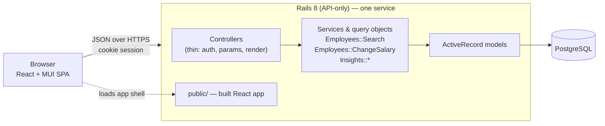
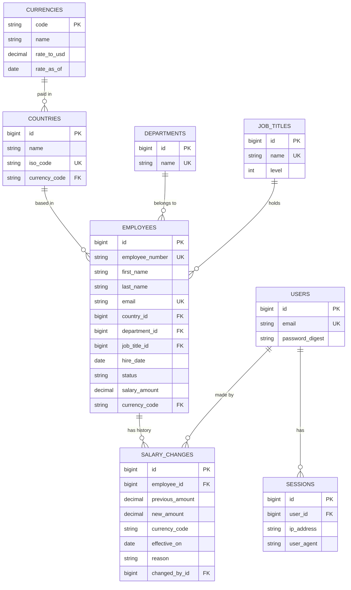

# Implementation Plan

How we will build the salary management software: the decisions, the design, and above all the
**order of work**, which is test-first. Read [requirements.md](requirements.md) first for the *what* and *why*.
This document is the *how*.

> Status: **everything in the plan is built** (see the table in §11): the backend, the frontend, the Docker image and
> the browser tests. What remains is for the owner to do: deploy the image to a host and record the demo video.
> Where the build taught us something that changed the plan, the section is updated and the change is listed in
> §17. The decisions in §2 were made on purpose and can be challenged; the reasoning is next to each one.

---

## 1. Approach in one paragraph

A **Rails 8.1 API** (Ruby 3.4) backed by **PostgreSQL** and a **React + TypeScript** single-page app, deployed as one
service (Rails serves the built React app, so there is one origin and no CORS). Every behaviour is
built **test-first** in thin vertical slices (database → API → UI). Statistics are computed **in SQL**, not in
Ruby or the browser. The 10,000-employee dataset comes from a **deterministic seed script** so the
demo, tests and performance checks all see the same data.

## 2. Key decisions

| # | Decision | Alternatives considered | Why |
|---|---|---|---|
| D1 | **Rails 8.1 API-only + React SPA in one repo** (`backend/`, `frontend/`) | Rails full-stack with Hotwire; Next.js | The brief asks for a Rails backend and a React UI. A monorepo keeps history, CI and docs in one place. |
| D2 | **PostgreSQL** | SQLite, MySQL | Percentile functions (`percentile_cont`), `width_bucket` and trigram indexes make the analytics simple and fast. A managed Postgres is easy to deploy. |
| D3 | **Serve the React build from Rails** (single deploy) | Vercel (UI) + Render (API) | One origin means httpOnly cookie auth works without CORS or cross-site cookie problems, and there is one thing to deploy and demo. |
| D4 | **Cookie session auth**, single HR role | JWT in localStorage; full RBAC | httpOnly cookies are not readable by JS (safer for salary data). One persona means one role. |
| D5 | **Minitest + FactoryBot** on the backend | RSpec | Minitest is the Rails default and already scaffolded, with fewer moving parts and a faster boot. FactoryBot keeps test data readable. |
| D6 | **Vitest + React Testing Library + MSW** on the frontend | Jest; Cypress-only | Vitest shares Vite's config and is fast. RTL tests behaviour, not implementation. MSW fakes the API at the network boundary. |
| D7 | **MUI** as the component library, with its plain `Table` and `TablePagination` (the plan first said DataGrid, see §17) | Mantine, Ant Design, MUI X DataGrid | Mature and accessible. Sorting, filtering and paging all happen on the server, so a grid's features would go unused. |
| D8 | **TanStack Query + React Router**; Recharts for charts; small pure functions for form rules (the plan first said React Hook Form + Zod, see §17) | Redux; custom fetch hooks | Server state is the hard part of this UI, and TanStack Query solves caching, loading and error states. Recharts is enough for a histogram. |
| D9 | **Salary stored as `decimal(14,2)` + ISO currency code**, converted to USD via a static `currencies.rate_to_usd` | Floats; cents integers; live FX API | Decimals avoid float error. Static dated rates keep every statistic deterministic and testable. |
| D10 | **Query objects and service objects** for logic; thin controllers | Fat models; `ActiveRecord` calls in controllers | Search, statistics and salary changes have real rules. Isolating them gives fast, focused unit tests. |
| D11 | **Portable multi-stage Dockerfile** for deployment | Platform-native buildpacks | Builds React, then runs Rails. Works on Render, Fly.io or Railway, so we are not locked in. |

## 3. Architecture



**Rules of the design**

- Controllers only authenticate, permit params, call one object, and render.
- Business rules live in models (validations), service objects (commands) and query objects (reads).
- The API returns plain JSON through small serializer classes, so the contract is explicit and testable.
- The frontend never computes statistics. It renders what the API returns.

## 4. Data model



**Rules**

- `employees.salary_amount` is the *current* annual base salary in `currency_code`. `salary_changes` is
  **append-only history**; a change writes the history row and updates the employee in one transaction.
- `status` is `active` or `inactive`. Employees are never hard-deleted; statistics count `active` only.
- Money is `decimal`, never `float`. Validations: amount `> 0`, currency exists, email unique and well-formed.
- `USD value = salary_amount × currencies.rate_to_usd`. Rates are seed data with a `rate_as_of` date shown in the UI.
- **Indexes** (added with the migration that needs them, not up front): `employees(country_id)`,
  `(department_id)`, `(job_title_id)`, `(status)`, `(country_id, salary_amount)` for filtered sorting, and a
  trigram index on the searchable name/email text.

## 5. API design

JSON only, cookie session, all routes except `POST /api/session` and `GET /api/health` require login.

| Method & path | Purpose |
|---|---|
| `POST /api/session` · `DELETE /api/session` · `GET /api/session` | Log in, log out, who am I |
| `GET /api/lookups` | Countries, departments, job titles, currencies (for filters and forms) |
| `GET /api/employees` | Directory: `q`, `country_id`, `department_id`, `job_title_id`, `status`, `sort`, `direction`, `page`, `per_page` (max 100). Returns `data` and `meta` (page, per_page, total). |
| `POST /api/employees` · `GET/PATCH /api/employees/:id` | Create, read, edit personal and organisational fields and status (deactivate instead of delete). Salary, currency and employee number are read-only on PATCH: sending them is a 422 `read_only_field`, not silently ignored. |
| `GET/POST /api/employees/:id/salary_changes` | Salary history, newest first; record a change (amount, optional new currency, effective date, reason). Attributed to the signed-in user; returns the new entry and the updated employee. |
| `GET /api/employees/export` | Downloads the current filtered directory as CSV (all matches, not one page), safe against spreadsheet formula injection |
| `GET /api/insights/overview` | Headcount, total payroll (USD), average salary, countries covered |
| `GET /api/insights/salary_stats?group_by=country\|department\|job_title` | Count, min, P25, median, P75, max, mean per group |
| `GET /api/insights/distribution?bucket_count=…` | Histogram of USD salaries |
| `GET /api/insights/top_earners?direction=asc\|desc&limit=…` | Highest or lowest paid |
| `GET /api/insights/outliers?limit=…` | Employees paid outside their peer group's Tukey fences, biggest deviation first |

Errors use one shape, `{ "error": { "code": "...", "message": "...", "details": {...} } }`, with correct
status codes: 400 (`bad_request`, `invalid_parameter`), 401 (`unauthenticated`, `invalid_credentials`),
404 (`not_found`), 422 (`validation_failed`, `read_only_field`) and 429 (`rate_limited`). The API is **not
versioned**: there is one client and it ships with the server.

## 6. Backend structure

```
backend/app/
  controllers/api/     # thin: sessions, employees, employee_exports, salary_changes, lookups, insights, health
  controllers/concerns/# Authentication (cookie session), EmployeeSearchable (shared search params)
  models/              # Employee, Country, Currency, Department, JobTitle, SalaryChange, User, Session, Current
  queries/employees/   # Search: filters + text search + sort + pagination as one testable object
  services/employees/  # ChangeSalary (transactional), CsvExport
  services/insights/   # Population (who is counted, USD conversion), Overview, SalaryStats, Distribution,
                       # TopEarners, Outliers
  services/seeding/    # Catalog, ReferenceData, EmployeeGenerator, SalaryHistory, HrUser, Runner
  serializers/         # EmployeeSerializer, SalaryChangeSerializer, UserSerializer
backend/db/seeds.rb    # calls Seeding::Runner and creates the HR login
backend/script/        # benchmark.rb (HTTP timing of every endpoint)
backend/test/          # mirrors app/: models, queries, services, controllers (request tests), support, factories
```

**Insight definitions (so tests and UI agree)**

- All insight figures use **active** employees, with salaries converted to **USD** at the stored rate.
- Percentiles use PostgreSQL `percentile_cont` (linear interpolation). Tests use small hand-computed datasets so expected values are exact.
- **Outliers:** within each (job title, country, currency) peer group of at least 5 active employees, flag salaries outside
  `[Q1 − 1.5·IQR, Q3 + 1.5·IQR]`. The quartiles are taken over the whole group, the salary being judged included
  (ten peers on 100k to 109k plus a 140k salary give fences of 95,000 and 115,000). Compared in local currency, so no FX
  is involved. Results are ranked by `deviation`, the distance beyond the fence as a share of the peer median, which is
  scale-free so INR and USD rank together.

## 7. Frontend structure

```
frontend/src/
  api/          # typed fetch client (ApiError, JSON bodies, 204s), query-string builder, one module per resource
  auth/         # session hooks, AuthGate, LoginPage
  components/   # AppLayout and small shared pieces
  features/     # employees/ (directory, detail, forms, salary history, status), insights/ (dashboard sections)
  lib/          # format.ts (money, dates, percentages), amount.ts, date.ts
  test/         # MSW server, fixtures (checked against the real API), helpers
  App.tsx       # routes: /login, /employees, /employees/new, /employees/:id, /employees/:id/edit, /insights
```

- **Screens:** Login · Employees (a table with server-side search, filters, sorting and paging, CSV export) · Employee page (profile, salary history, change salary, edit, deactivate) · Add and edit employee · Insights (KPI cards, pay by group, distribution chart, highest and lowest paid, outliers).
- **Forms:** each form's rules and request bodies are pure functions (`employeeForm.ts`, `salaryChangeForm.ts`) tested on their own. They check before sending, show the server's per-field messages beside the fields, and clear a field's message as soon as it is edited.
- **Code splitting:** the Insights page (and with it the chart library, a further 357 kB chunk) is only downloaded when it is opened.
- **State:** server state in TanStack Query; filters live in the **URL query string**, so views are shareable and survive refresh.
- **Money:** one formatter renders local amounts (`Intl.NumberFormat` with the currency code) and USD-converted ones, so formats never drift.
- Every data view has explicit **loading, empty and error** states, and each is tested.

## 8. Seeding strategy

- One command (`bin/rails db:seed`) creates reference data and **exactly 10,000 employees**.
- **Deterministic:** a fixed-seed `Random`, and names come from embedded lists rather than a gem, so every run produces the same data and the tests and screenshots are reproducible.
- **Realistic:** 8 countries (each with a currency and a static USD rate), 8 departments and 28 job titles across levels.
  Salary = title base × country cost factor × tenure × a bell-shaped spread, converted into the local currency, plus a
  deliberate outlier every 500th employee so that feature has something to find. About 5% of employees are inactive.
- **History:** about two thirds of the people employed for over a year get one to three past raises, worked out
  backwards from their current salary so every history ends exactly at it (10,053 changes for 6,403 employees). Each
  employee has their own random generator derived from the seed, so re-running is idempotent.
- **Fast:** built in memory and inserted with `insert_all` in batches of 1,000. Measured: 10,000 employees in about 3 s including Rails boot. There is no per-record `create`.
- **Idempotent:** re-running does not duplicate rows. The employee count is a parameter (`SEED_EMPLOYEES`, default 10,000) so tests use a small number.
- Also seeds the HR login from `HR_EMAIL` and `HR_PASSWORD`, never hardcoded. Local development gets a documented demo login; any other environment must supply the credentials.

## 9. Test-driven development

TDD is the central working method, not a phase at the end.

### 9.1 The loop, per behaviour

1. **Red:** write one small failing test that states the behaviour in plain words. Run it and *see it fail for the right reason*.
2. **Green:** write the least code that passes.
3. **Refactor:** clean up with the tests green. Run the whole suite.
4. **Commit** at each stable point. Where practical this is a `test:` commit followed by a `feat:` commit, so the history shows test-first (see §11).

Rules: no production code without a failing test that demands it; one behaviour at a time; bug fixes start with a test that reproduces the bug.

### 9.2 What each layer tests

| Layer | Tests | Speed / style |
|---|---|---|
| **Models** | Validations, scopes, associations, money rules | Milliseconds; DB with FactoryBot. |
| **Query and service objects** *(the bulk)* | `Employees::Search` filters, combinations, sort stability, pagination caps; `ChangeSalary` transaction and history; every statistic against small hand-computed datasets (e.g. 5 salaries → median exactly X) | Fast and exact, where correctness is really proven. |
| **Request tests** | Auth required (401), response shape, status codes, validation errors (422), and **query-count assertions** to catch N+1 | Exercise routing, params and JSON together. |
| **Seed tests** | Requested count produced, deterministic (same seed → same data), idempotent, all rows valid | Use a small count so they stay fast. |
| **Frontend components / hooks** | Loading, empty, error and success states; filter changes update the request and the URL; form validation; money formatting | RTL + MSW, asserting what the user sees. |
| **One E2E test** | Sign in → find someone → add an employee → change their salary → read the insights → sign out | Playwright in Chromium against the production image (see [e2e/README.md](../e2e/README.md)); about 9 s. |

### 9.3 Conventions that keep tests fast, deterministic and readable

- **No network, no real clock, no shared state.** Freeze time with `travel_to`, seed any randomness, and use transactions for isolation.
- **Small explicit datasets.** A test creates only the rows it needs, so the expected value is obvious from reading it.
- **Names are sentences:** `test "filters by country and status together"`; the failure message says what broke.
- **One reason to fail** per test; Arrange–Act–Assert layout.
- **Targets:** backend suite under ~30 s, frontend under ~15 s. If a test is slow, fix the test. Today the backend suite is 264 tests and runs in about 5 s (27 s in a fresh container). The frontend suite is 155 tests and takes about 20 s (29 s in a container), **over the 15 s target**: MUI renders slowly in jsdom, and the create-employee tests fill fields with paste rather than typing each character to keep them fast.
- **Coverage** is reported (SimpleCov, Vitest coverage) as a signal, not a goal. We check that core logic branches are covered, not a percentage.
- **CI is the gate:** tests, RuboCop, Brakeman, ESLint/oxlint, type-check and build all run on every push.

### 9.4 Worked example: `Employees::Search`

Tests written first, in this order (each one red → green):

1. returns all employees, paginated, when no filters are given
2. filters by `country_id`
3. combines several filters with AND
4. `q` matches first name, last name or email, case-insensitively
5. sorts by salary descending with `id` as a stable tie-breaker
6. `per_page` above 100 is capped at 100
7. loading the page issues a constant number of queries (no N+1)

Only then does the query object get written, one test at a time. The controller test afterwards only checks wiring, because the rules are already proven.

## 10. Performance plan

- Data is small (10,000 rows), so the approach is **correct SQL, right indexes, and measurement**, not caching.
- Aggregation and percentiles run in PostgreSQL; the browser never receives 10,000 rows. The list is paginated server-side.
- Query-count assertions prevent N+1 regressions; `EXPLAIN ANALYZE` confirms each index is used.
- A small benchmark script ([backend/script/benchmark.rb](../backend/script/benchmark.rb)) times every endpoint over HTTP against the seeded 10,000 rows. Target: p95 under ~300 ms.
- We only add an index, cache or materialized view if a measurement shows the need, and the doc records why.
- **Result:** every interactive endpoint is under 60 ms at p95, so no extra index, cache or materialised view was added. The numbers, the `EXPLAIN ANALYZE` plans and what to revisit at 100x the data are in [performance.md](performance.md).

## 11. Delivery plan (incremental commits)

Each milestone is a vertical slice, built test-first, ending in a working, committed state.
Commit messages use Conventional Commits (`docs:`, `test:`, `feat:`, `refactor:`, `chore:`, `ci:`).

| # | Milestone | Tests come first for… | Outcome | Status |
|---|---|---|---|---|
| 0 | **Docs** | n/a | Requirements, this plan, README | Done |
| 1 | **Tooling & CI** | A trivial passing test on each side proves the harness | FactoryBot, SimpleCov, RuboCop, Brakeman; Vitest + RTL + MSW; CI at repo root | Done |
| 2 | **Reference data & Employee model** | Model validations, associations, money rules | Migrations and models for countries, currencies, departments, job titles, employees | Done |
| 3 | **Seed script** | Count, determinism, idempotency, validity | 10,000 realistic employees in seconds | Done, including salary history |
| 4 | **Authentication** | Login/logout, 401 on protected routes, rate limiting | HR user can sign in; API is protected | Done |
| 5 | **Employees API** | `Employees::Search` (§9.4), CRUD request tests, 422 errors | Directory, create, edit, deactivate | Done |
| 6 | **Salary changes** | `ChangeSalary` transaction, history order, invalid input | Salary edits with an append-only history | Done |
| 7 | **Insights API** | Each statistic against hand-computed data; active-only; USD conversion | Overview, stats by group, distribution, top/bottom earners | Done |
| 8 | **Frontend shell** | Auth gate, routing, API client error handling | Login, layout, typed client | Done |
| 9 | **Employees UI** | Table states, filter → URL → request, form validation | Directory, create/edit, detail, deactivate | Done |
| 10 | **Salary UI** | History rendering, change-salary form and validation | Change salary, see history | Done |
| 11 | **Insights dashboard** | KPI/table/chart rendering from fixtures, empty and error states | The HR manager's dashboard, including outliers | Done |
| 12 | **Should-haves** | Outlier rules; CSV columns and filtering | Outliers view, CSV export | Done (API, export link and dashboard section) |
| 13 | **Ship** | Smoke test against the running image | Dockerfile, Render blueprint, performance notes, browser test, final README | Done, except deploying to a real host and the demo video, which need the owner's account and screen |

Milestones 2–7 (backend) and 8–11 (frontend) could overlap once the API contract for a slice was fixed by its request tests; in practice the backend was finished first, and the frontend's fixtures were then checked against the real API's responses.

## 12. Security & privacy

- Passwords hashed with `has_secure_password` (bcrypt); session in a signed, `httpOnly`, `SameSite=Lax` cookie that is `Secure` whenever TLS is enforced (`FORCE_SSL`, on by default in production). The session lives in the database, so logging out or expiry (14 days) invalidates a copied cookie.
- CSV export neutralises spreadsheet formulas in names and emails (a value starting with `=`, `+`, `-`, `@`, tab or CR is prefixed with an apostrophe).
- Login is **rate limited**; failures return the same message whether the email or password was wrong.
- CSRF: `SameSite=Lax`, JSON-only requests, same origin. Revisit if the API is ever served cross-origin.
- Strong parameters everywhere; ActiveRecord parameterised queries only (Brakeman runs in CI).
- No secrets in git: `master.key`, `.env*` are ignored, and deployment secrets come from the platform. The demo user is created from environment variables.
- The demo dataset is entirely synthetic. No real employee data is ever used.
- Left out on purpose: MFA, RBAC, field-level encryption. See [requirements.md](requirements.md).

## 13. Deployment & CI

- **CI (GitHub Actions, `.github/workflows/ci.yml`):** backend tests (against a Postgres 17 service) + RuboCop + Brakeman on the Ruby in `backend/.ruby-version`; frontend lint + tests + type-check and build on Node 22. The jobs were replayed in `ruby:3.4.6`, `postgres:17` and `node:22` containers, which is also what proved `db/schema.rb` builds a working database from scratch. They have not yet run on GitHub itself. The browser tests are not part of CI (they need the image built and a database); they are run by hand, see [e2e/README.md](../e2e/README.md).
- **Deploy:** one multi-stage Dockerfile builds the React app, installs the gems, and produces a slim non-root runtime with the build in Rails' `public/`. `FrontendController` serves the app shell for every client-side route (and for nothing under `/api`, the health checks, or anything that looks like a file). `bin/start-production` migrates, seeds an empty database, sets the HR login and starts Puma. Target host is **Render** with managed Postgres (`render.yaml`); Fly.io or Railway work the same way. Details, environment variables and what was verified are in [deployment.md](deployment.md).
- **Production configuration** was simplified for a single database: the Rails 8 defaults (Solid Cache, Queue and Cable, each with its own database) are removed, as this app has no background jobs or websockets; the cache holds only the login rate limiter, in memory, which is right for one Puma process.
- The README carries the live URL, the demo credentials and the demo video link, once the owner has them.

## 14. How AI is used

The brief asks us to use AI on purpose, so the process is part of the deliverable.

- **Division of labour:** the human owns *what* and *why*: requirements, scope cuts, the test cases that define behaviour, and review. AI accelerates *how*: drafting implementations, boilerplate, and alternatives.
- **Tests drive the AI.** The failing test is the prompt's specification. AI writes code to make it pass, and we read and understand every diff before committing.
- **Verification is never delegated:** tests, linters and CI decide whether code is right. AI output that does not pass is fixed or discarded, not argued with.
- **What that looked like in practice.** The tests caught the AI's own mistakes repeatedly, which is the point of the method: a `json` 3.x incompatibility that broke request parsing (found by the first test that POSTed JSON), a missing `csv` gem on Ruby 3.4, test data that built a record without persisting its currency, and my own arithmetic error in a comment about outlier fences (the test data forced the correct numbers). A Brakeman "SQL injection" warning on a whitelisted table name was resolved by restructuring the code with Arel rather than by suppressing it. Each is recorded in the commit that fixed it.
- **Later mistakes caught the same way:** the frontend's hand-written fixtures could have drifted from the real API, so they were compared with its live responses (all 17 request shapes match); a Docker build failed on an unset `BUNDLE_PATH`; running the production image found the app shell cached for a year and pages returning 404 to clients that send only `Accept: */*`; and a real browser found validation messages that stayed under fields already corrected. Each was reproduced by a failing test before it was fixed.
- **Artifacts (written as we go, not reconstructed at the end):** the history of red and green commits is the primary record; measurements are in [performance.md](performance.md); how AI was used, and what it got wrong, is in [ai-usage.md](ai-usage.md).

## 15. Risks & open questions

| Risk / question | Mitigation / current answer |
|---|---|
| Seed data looks fake, so the insights are dull | Model salary from title, level and country with realistic spread, and add planted outliers. Review the dashboard against the seed early (milestone 7). |
| Statistics disagree between SQL and UI | Statistics are computed only in SQL. The UI renders numbers, so tests pin exact values. |
| Free-tier hosting limits (sleep, DB expiry) | Portable Dockerfile; verify limits before choosing; note cold-start time in the README. |
| Scope creep (CSV import, gender pay analysis) | They are written into "left out" with reasons; the *Should* items only start after every *Must* is done and green. |

**Assumptions to confirm** (defaults in brackets; cheap to change now, expensive later):
component library (**MUI**), hosting (**Render**), CSV import deferred (**yes**), one HR role (**yes**), PostgreSQL over SQLite (**yes**).

## 16. Definition of done

A milestone is done when: its tests were written first and pass; the whole suite and CI are green; new
behaviour is covered at the right layer; RuboCop/Brakeman/lint are clean; docs affected by the change are
updated; and the work is committed with a message that says *why*.

## 17. What changed from the plan while building

The plan was a starting point. These are the places where the build taught us something, with the reason.

| Change | Why |
|---|---|
| Rails **8.1** and Ruby **3.4.6**, not Rails 8.0 / Ruby 3.2 | Brakeman flagged Rails 8.0 support ending 2026-11-07 and Ruby 3.2 as end of life. Cheaper to move before there was any code. |
| `json` gem pinned **below 3** | json 3.x breaks Rails 8.1 (parsing a JSON request body raises and returns 400). The first attempt to drop the pin was wrong: it tested rendering, not parsing. The first test that POSTed JSON caught it. |
| `csv` gem added | `csv` stopped being a default gem in Ruby 3.4. |
| `PATCH /api/employees/:id` **rejects** salary, currency and employee number (422 `read_only_field`) | The plan said they would be ignored. For money data that is dangerous: a client would believe the salary changed. Salary changes go through their own endpoint so they leave a history. |
| CSV export is `GET /api/employees/export`, not `/api/employees.csv` | API-only Rails has no `respond_to`; a separate endpoint is simpler and just as clear. |
| A salary change can carry a **new currency** (previous and new amount and currency are both stored) | An employee who transfers countries changes currency and amount together; storing only an amount would misdescribe that. |
| Seed data includes **salary history** | Otherwise the history view is empty in the demo. |
| **No extra database indexes** (no `pg_trgm`, no index on `status`) | Measured: the slowest query is about 15 ms on 10,000 rows. See [performance.md](performance.md). |
| Benchmark is a plain **HTTP client**, not a `rails runner` script | An in-process version broke Rails' execution context, and real HTTP is the more honest measurement. |
| Tests live under `test/queries`, `test/services`, `test/support` | Mirrors the new `app/queries` and `app/services` directories. |
| The directory uses MUI's `Table` and `TablePagination`, not the **DataGrid** | Sorting, filtering and paging are all server-side, so the grid's features would go unused; it would add a lot to the bundle; and it is awkward to test without a real browser. |
| Forms use **small pure functions** for their rules, not React Hook Form and Zod | There are two forms, and their rules (required fields, amounts, dates, the server's 422 messages) are simple. Plain functions are tested on their own and add no dependencies. |
| The Insights page is **lazy-loaded** with its chart as a separate chunk | The chart library is 357 kB and only one page uses it. |
| Production drops **Solid Cache, Queue and Cable** and uses one database and an in-memory cache | The Rails 8 defaults want four databases; this app has one, no background jobs and no websockets. |
| `FORCE_SSL` controls TLS enforcement, and the session cookie is `Secure` whenever it is on | Lets the same image be tried over plain HTTP locally while staying strict by default; the old rule keyed the cookie to the environment name. |
| Every client route is answered by `FrontendController`; the static file server no longer serves `/` | Found by running the image: the static server answered `/` with a one-year cache header, so a browser would keep an old shell after a deploy; and the catch-all route wrongly depended on the `Accept` header. |
| A **Playwright browser test** against the production image | It found a bug the jsdom tests could not (validation messages that stayed after being fixed). Not in CI, because it needs the image built and a database; run by hand. |
| The frontend suite takes about 20 s, over the 15 s target | MUI renders slowly in jsdom. Fields are filled by paste in the long form tests, and the timeout is 15 s per test for slower CI machines. |
